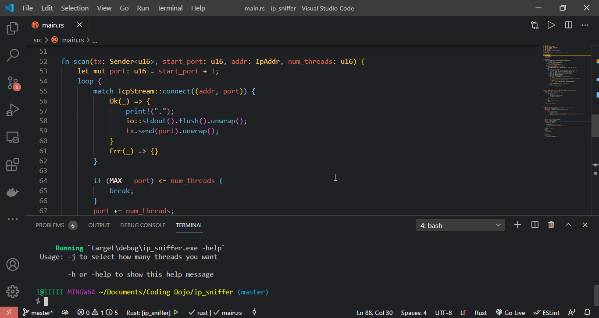

# Port Sniffer Written in Rust

Port sniffer CLI hecho con solo la **std library** de Rust 🦀.

- ejecuta `cargo run -- -help` para ver la ayuda.
- `cargo run -- -j "threads_number" "ipaddr"` para escanear.

